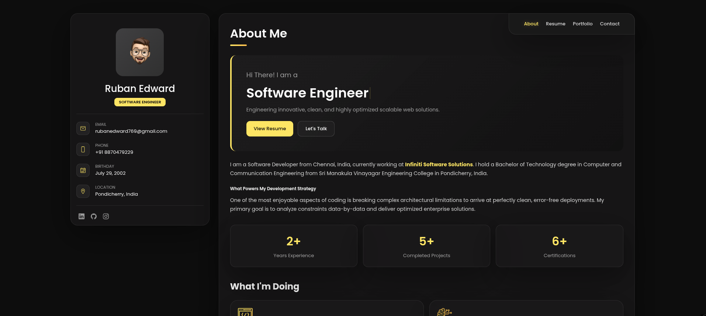
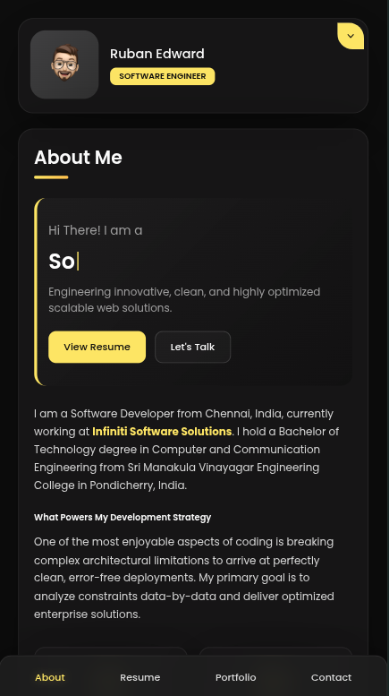
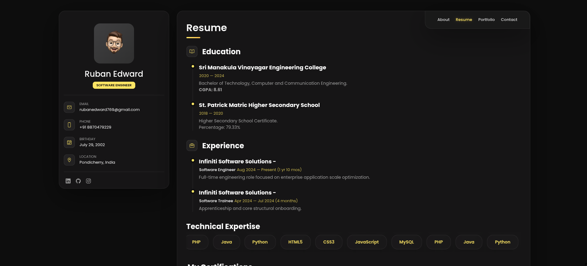
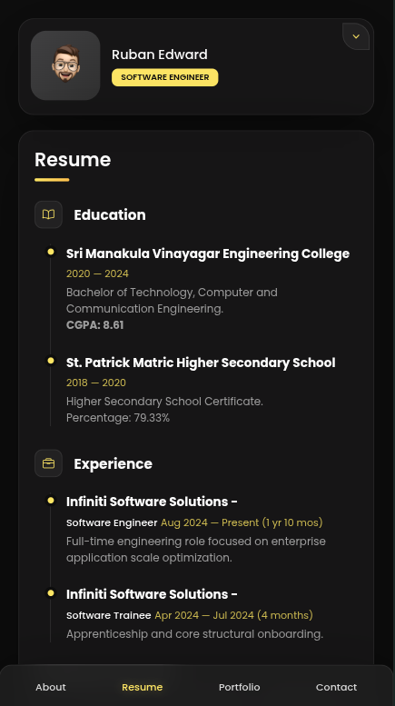

# 🌐 My Personal Portfolio

A modern, responsive personal portfolio website showcasing my projects, skills, experience, and contact information.

## ✨ Preview

### 💻 Desktop View

<p align="center">
   
</p>

### 📱 Mobile View

<p align="center">
  
</p>

---

## 🚀 Features

- 🎨 Modern and clean UI
- 📱 Fully responsive design
- ⚡ Fast loading performance
- 🌙 Smooth animations
- 💼 Projects showcase
- 👨‍💻 Skills section
- 📄 About Me section
- 📬 Contact section
- 🔗 Social media links

---

## 🛠️ Built With


---

## 📂 Project Structure

```text
.
├── assets/
│   ├── images/
│   ├── css/
│   └── js/
├── index.html
└── README.md
```

---

## 📸 Screenshots

| Desktop | Mobile |
|----------|---------|
|  |  |

---

## ⚙️ Getting Started

Clone the repository:

```bash
git clone https://github.com/Ruban-Edward/Ruban-Edward.github.io.git
```

Navigate to the project folder:

```bash
cd your-repository
```

Open `index.html` in your browser.

---

## 📬 Contact

Feel free to reach out if you'd like to collaborate or connect.

- GitHub: https://github.com/Ruban-Edward/Ruban-Edward.github.io.git
- LinkedIn: https://linkedin.com/in/ruban-edward
- Portfolio: https://ruban-edward.github.io

---

## ⭐ Support

If you like this project, consider giving it a ⭐ on GitHub!

---

<p align="center">
Made with ❤️ by <b>Ruban Edward</b>
</p>
